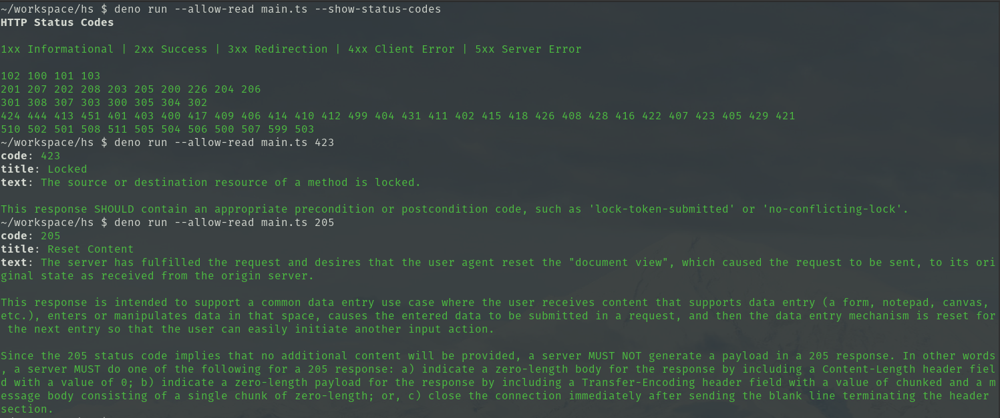

# hs

Print HTTP status details



## How to use

Pass in an HTTP status code:
```sh
hs 200
```

Use `-s|--show-status-codes` to see available HTTP status codes:
```sh
hs --show-status-codes
```

Use `-h|--help` to see the help message:
```sh
hs --help
```

## How to install

```sh
git clone https://github.com/naltun/hs.git && cd hs
mkdir --parents $HOME/.config/hs
mv codes/ $HOME/.config/hs/
deno install --allow-env --allow-read main.ts
```

## License

With the exception of files in the `codes/` directory, files in this codebase
are licensed under the terms of the Mozilla Public License, v2.0. Please see
LICENSE for details.

Every file in the `codes/` directory is copied from the
[httpstatuses](https://github.com/httpstatuses/httpstatuses/tree/main/contents/codes)
project. Please see the project's repository for LICENSE details.
