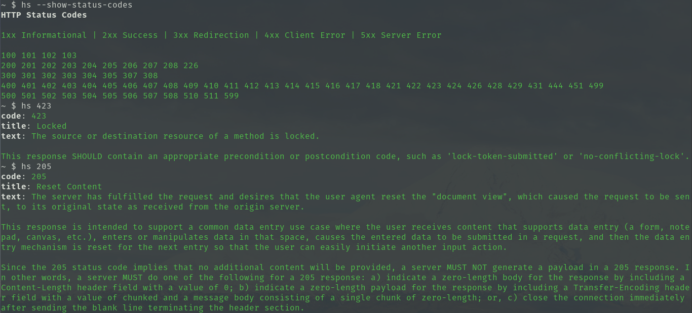

# hs

Print HTTP status details



## Usage

From within the project root:

```sh
deno run --allow-read main.ts [-h|--help] <HTTP status: number>
```

NOTE: deno.land/x/ hosting coming soon...

## License

With the exception of files in the `codes/` directory, files in this codebase
are licensed under the terms of the Mozilla Public License, v2.0. Please see
LICENSE for details.

Every file in the `codes/` directory is copied from the
[httpstatuses](https://github.com/httpstatuses/httpstatuses/tree/main/contents/codes)
project. Please see the project's repository for LICENSE details.
